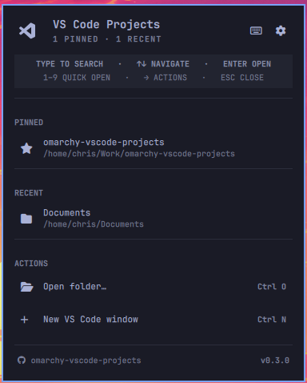

# VS Code Projects for Omarchy

A compact, keyboard-friendly Omarchy bar widget for opening recent and pinned VS Code projects.

Current version: [`0.3.1`](./manifest.json) · License: [MIT](./LICENSE) · Requires Omarchy 4.0+



## Features

- Reads recent local folders and `.code-workspace` files from VS Code, Insiders, VSCodium, and Code OSS.
- Keeps pinned projects above the recent-project history.
- Filters projects immediately as you type.
- Opens projects in the current window or a new window.
- Opens a terminal in the project, reveals its folder, or copies its path.
- Includes a settings view for project limits, default open mode, refresh, and pin cleanup.
- Shows a clickable repository link and manifest-sourced version in the default panel footer.
- Uses Omarchy's native panel components, theme colors, spacing, typography, keyboard focus, and bar behavior.
- Stores pins locally and performs no network requests or telemetry.

Remote workspaces are intentionally hidden because reopening them reliably depends on their remote provider. Missing local paths and individual recent files are filtered out.

## Requirements

- Omarchy 4.0 or newer
- Python 3 (`python` package; standard library only)
- Zenity (`zenity`) for the external folder picker
- Wayland clipboard tools (`wl-clipboard`) for **Copy path**
- Nautilus (`nautilus`) for **Reveal in files**
- At least one supported editor command: `code`, `code-insiders`, `codium`, or `code-oss`

Check the supporting commands with `command -v python3 zenity wl-copy nautilus`. Install anything missing with:

```bash
omarchy pkg add python zenity wl-clipboard nautilus
```

## Installation

```bash
omarchy plugin add https://github.com/christestet/omarchy-vscode-projects.git --enable
```

Choose a bar section when prompted. The default placement is the right section.

To enable or move it later:

```bash
omarchy plugin enable christestet.vscode-projects --section right
omarchy bar move christestet.vscode-projects --section right
```

## Usage

### Bar icon

| Input | Action |
|---|---|
| Left click | Open or close the projects panel |
| Right click | Refresh recent projects |
| Middle click | Open a new VS Code window |

Hovering the icon shows the panel name and its `Super+Alt+O` shortcut in a concise native Omarchy tooltip.

### Project list

| Input | Action |
|---|---|
| Type | Filter projects by name or path |
| Up / Down | Move the selection |
| Enter / Left click | Open the selected project |
| Shift+Enter / Middle click | Open the project in a new window |
| Right Arrow / Right click | Show project actions |
| Escape | Clear search, return from actions, or close the panel |
| 1–9 | Open the corresponding visible project |
| Ctrl+O | Open a folder picker |
| Ctrl+N | Open a new VS Code window |
| Ctrl+R | Refresh recent projects |

### Project actions

- Open
- Open in new window
- Open terminal here
- Reveal in files
- Copy path
- Pin or unpin project

### Settings

Select the gear button beside **VS Code Projects** to open Settings. From there you can:

- Set the number of recent projects shown with a slider (3–30).
- Choose whether projects reuse the current editor window or open a new one.
- Refresh the project history.
- Unpin all projects with a second-press confirmation.

The slider supports dragging, clicking, and mouse-wheel adjustments. `−` and `+` remain available for keyboard adjustment. Changes are persisted through Omarchy's native bar configuration.

Select the keyboard button beside **VS Code Projects** for a complete, scrollable reference of keyboard and mouse shortcuts. Select it again, press `Left`, or press `Escape` to return.

Pinned projects are stored in:

```text
~/.config/omarchy/vscode-projects.json
```

## Configuration

The widget exposes these settings through Omarchy's bar configuration:

| Setting | Default | Description |
|---|---:|---|
| `maxProjects` | `10` | Maximum number of recent projects, from 3 to 30 |
| `openMode` | `reuse` | Open projects in the existing window (`reuse`) or a new window (`new`) |

Example entry in `~/.config/omarchy/shell.json`:

```json
{
  "id": "christestet.vscode-projects",
  "maxProjects": 10,
  "openMode": "reuse"
}
```

## IPC and keybindings

The panel provides Omarchy's standard plugin IPC surface:

```bash
omarchy-shell shell toggle christestet.vscode-projects
omarchy-shell shell summon christestet.vscode-projects
omarchy-shell shell hide christestet.vscode-projects
omarchy-shell christestet.vscode-projects refresh
omarchy-shell christestet.vscode-projects openRecent
omarchy-shell christestet.vscode-projects openFolder
omarchy-shell christestet.vscode-projects newWindow
```

These commands can be used from personal Hyprland keybindings.

For example, add native Omarchy/Hyprland bindings to `~/.config/hypr/bindings.lua`:

```lua
o.bind("SUPER + ALT + O", "VS Code projects", "omarchy-shell shell toggle christestet.vscode-projects")
o.bind("SUPER + CTRL + ALT + O", "Open recent VS Code project", "omarchy-shell christestet.vscode-projects openRecent")
```

Check `omarchy menu keybindings --print` first and change the chords if they conflict with existing bindings.

## How it works

`Panel.qml` renders the native bar button and popup. The folder picker runs as a separate Zenity process so GTK is kept outside the long-running Quickshell process. `recent_projects.py` reads the `history.recentlyOpenedPathsList` value from each editor's local `state.vscdb` database and falls back to workspace metadata when needed. It uses `/usr/bin/python3`, requires no third-party Python packages, and opens SQLite in read-only mode. Global actions automatically use the first available editor, preferring the editor associated with a pinned or recent project.

Editor state is treated as untrusted, replaceable input. JSON values are limited to 1 MiB, SQLite databases and sidecars to 64 MiB, recursive history traversal to 4,096 nodes and 20 levels, and workspace discovery to 256 entries per editor. SQLite work, returned projects, pin data, helper output, and QML output accumulation are also bounded. Oversized or malformed state is ignored so it cannot exhaust the long-running shell process.

Supported editor data directories:

| Editor | Configuration directory |
|---|---|
| VS Code | `~/.config/Code` |
| VS Code Insiders | `~/.config/Code - Insiders` |
| VSCodium | `~/.config/VSCodium` |
| Code OSS | `~/.config/Code - OSS` |

## Updating and removal

```bash
omarchy plugin update christestet.vscode-projects
omarchy plugin remove christestet.vscode-projects
```

Removing the plugin does not delete the optional pin file at `~/.config/omarchy/vscode-projects.json`.

## Troubleshooting

Validate a checkout:

```bash
omarchy plugin validate .
```

Refresh plugin discovery and open the panel:

```bash
omarchy-shell shell rescanPlugins
omarchy-shell shell summon christestet.vscode-projects
```

If no recent projects appear, open a local folder in a supported editor first. Remote-only workspaces and missing paths are intentionally omitted.

## Development

```bash
omarchy plugin validate .
python3 -m unittest discover -s tests -v
```

Files below `~/.config/omarchy/plugins/` hot-reload during development. Before publishing a release, update the version in `manifest.json` and the linked version text near the top of this README to the same value.

## Privacy and security

The plugin reads editor history only from local configuration files. It performs no network requests and sends no telemetry. Like every Omarchy shell plugin, it runs unsandboxed inside `omarchy-shell`; review third-party plugin code before installing it.

## License

[MIT](./LICENSE)
